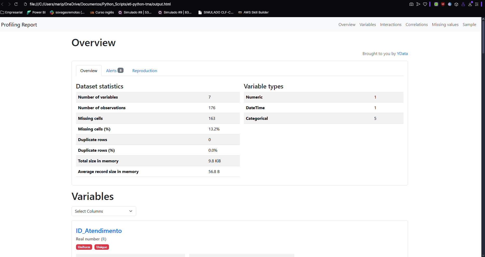
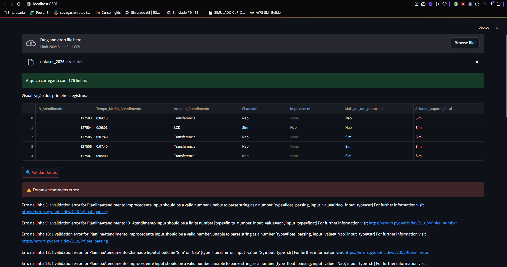
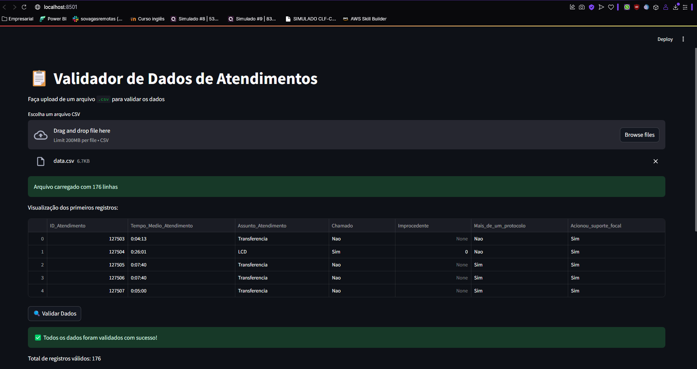
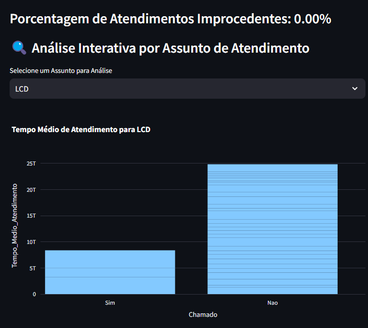

# Pipeline ETL com Python: Validando Dados e Planilhas de Excel para um Dashboard

Este projeto visa criar um pipeline ETL utilizando Python, focando na validação de dados e na transformação de planilhas de Excel em um dashboard interativo e informativo. O objetivo é acompanhar o desempenho durante as minhas tarefas de atendimento na empresa, garantindo a qualidade e integridade dos dados antes de serem visualizados.

## Funcionalidades do Projeto

### 1. **Profile Report do Pandas Profiling**
A primeira etapa do pipeline consiste em gerar um **relatório de perfil** (Profile Report) utilizando a biblioteca **Pandas Profiling**. Esse relatório fornece uma análise exploratóriado dataset, destacando a distribuição dos dados, valores ausentes, correlações, e outros insights valiosos para entender a qualidade do dataset.

- **Arquivo:** `main.py`
- **Print da funcionalidade:**
  


### 2. **Contrato de Dados**
Em seguida, utilizamos um **contrato de dados** para garantir que os dados preenchidos estejam dentro de um padrão específico. Este contrato é configurado em um arquivo separado para ser utilizado como referência durante a validação dos dados.

- **Arquivo:** `validador_dados.py`


### 3. **Validação do Dataset**
A terceira etapa do pipeline envolve a **validação** do dataset. Após preencher o arquivo `.csv`, a aplicação irá verificar se os dados estão dentro das condições aceitas no contrato de dados. Caso um erro seja encontrado, ele será identificado, juntamente com a linha do erro e sugestões de onde procurar a solução.

- **Arquivo:** `aplicacao.py`
- **Print da funcionalidade:**
  

  *Na imagem acima, o validador identificou erros nos dados, como campos fora do contrato, tipos incorretos ou valores inválidos. A linha e o tipo do erro são mostrados para facilitar a correção.*

  

  *Após as correções, os dados são validados com sucesso, sem erros detectados. Isso garante que o dataset está pronto para ser usado no dashboard.*


### 4. **Dashboard de Visualização**
Após corrigir os erros e garantir que os dados estão de acordo com o contrato, o último passo do pipeline é enviar os dados para um **dashboard**. O dashboard é projetado para fornecer uma visualização simples, mas fiel ao objetivo de acompanhamento de desempenho. Ele exibe métricas e gráficos baseados no dataset validado.

- **Arquivo:** `dashboard.py`
- **Print da funcionalidade:**
  


## Como Executar

Para rodar este projeto localmente, siga os seguintes passos:

### 1. Clone este repositório:
```bash
git clone https://github.com/seu-usuario/pipeline-etl-dashboard.git
cd pipeline-etl-dashboard
```

### 2. Instale as despedências:
``` bash
pip install -r requirements.txt
```

### 3. Execute o script main.py para gerar o profile report:
``` bash
python main.py
```

### 4. Defina as regras de validação no arquivo validador_dados.py.
Cada contrato de dados precisa de um validador, então é necessário a definição do validador.

### 5. Execute o script aplicacao.py para validar o dataset:
``` bash
streamlit run src/aplicacao.py
```

### 6. Visualize o dashboard com os dados validados.
O dashboard pode variar conforme as necessidades do usuário, desde que ele faça essas alterações no:
```bash
streamlit run src/aplicacao.py
```

## Contato

🔗[Conecte-se comigo no LinkedIn](https://www.linkedin.com/in/marianapacini-dataengineer/)